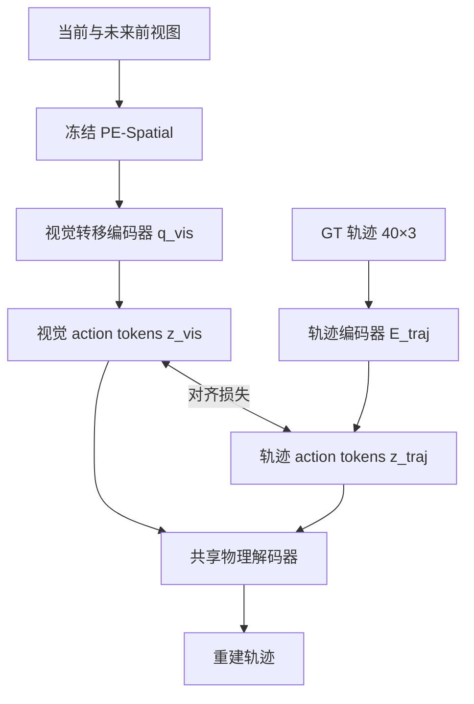
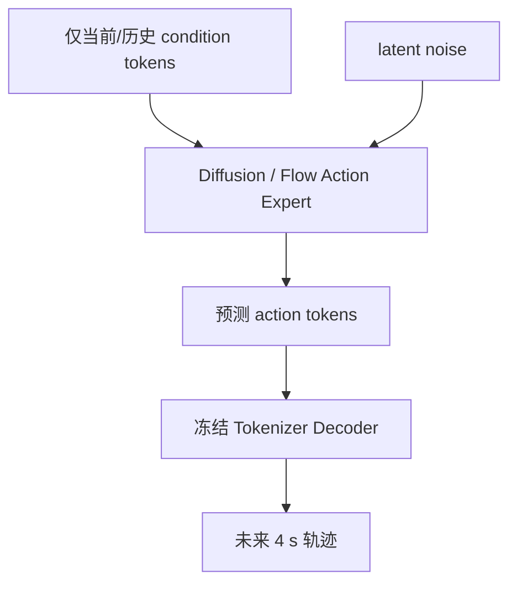

# Vision-Aligned Action Tokenizer：工程与实验计划

> 状态：实现稿 v0.3（LiDAR sweep 轨迹设置）
> 首个验证数据集：nuScenes，前视相机，4 s 规划时域
> 核心目标：将未来轨迹从手工的 `[T, 3]` 数值空间映射到由视觉状态转移监督的连续 action-token 空间，并令 diffusion/flow action expert 在该空间内生成动作。

---

## 1. 研究问题与核心判断

当前 action expert 直接对未来轨迹

\[
\mathbf A = \{(x_t,y_t,\psi_t)\}_{t=1}^{40}\in\mathbb R^{40\times3}
\]

加噪并去噪，主要存在三个问题：

1. `x/y/yaw` 三个数值维度与视觉 condition tokens 不在同一特征空间，action expert 需要从头学习跨模态映射；
2. 单个轨迹点只有几何意义，没有“减速让行、跟车、转弯、穿越路口”等视觉行为语义；
3. 点空间中的独立噪声会破坏轨迹的低维运动结构，模型需额外学习连续性和物理约束。

本项目验证以下核心假设：

> 如果一个低维 action latent 必须从“当前视觉状态 → 未来视觉状态”的转移中提取，并且该 latent 同时能够重建真实自车轨迹，那么它会比原始轨迹点更接近视觉 condition 的表征空间，也更适合作为 action expert 的生成目标。

这里更准确的术语是 **visual inverse planning / visual transition encoding**。如果最终输出仍是 `[x,y,yaw]` 轨迹，它不是严格意义上由动力学方程求转向、油门和制动的“逆动力学”；只有未来需要恢复 steering/throttle/brake 时，才加入车辆逆动力学模块。

### 1.1 一个必须避免的逻辑漏洞

仅使用“视觉序列编码 → latent → 轨迹重建”的 VAE，并不能自动证明 latent 与视觉语义对齐。VAE latent 在可逆变换下并不唯一，编码器仍可能学出另一套任意的轨迹编码。

因此，正式模型除了轨迹重建与 KL，还必须加入：

- **视觉转移约束**：latent 能预测 PE 空间中的未来视觉变化；
- **轨迹—视觉对齐约束**：同一段行为的视觉 latent 与轨迹 latent 接近，不同行为拉开；
- **共享解码约束**：视觉 latent 和轨迹 latent 均通过同一个 decoder 重建轨迹；
- **语义可验证性**：通过行为分类、跨模态检索、latent 插值和 action expert 下游指标证明 latent 确实更有结构。

---

## 2. 时间定义：5 帧 1 Hz keyframe 与 40 点 LiDAR 轨迹

视觉与动作使用独立时间轴，并将所有时间设置配置化：

| 方案 | 视觉时间戳（含当前帧） | 帧数 | 覆盖范围 | 用途 |
|---|---:|---:|---:|---|
| A，当前默认 | `[0, 1, 2, 3, 4] s` | 5 | 4 s | 官方 CAM_FRONT keyframe |
| B | `[0, 0.5, ..., 4.0] s` | 9 | 4 s | 使用全部 2 Hz keyframe |
| C | `[0, 1/12, ..., 4.0] s` | 49 | 4 s | 12 Hz 相机流高成本上界 |

默认动作定义为：

```text
anchor time:       t0
teacher images:    t0 + [0, 1, 2, 3, 4] s，官方 CAM_FRONT keyframe
window trajectory: t0 + [0.1, 0.2, ..., 4.0] s，LiDAR keyframe+sweeps
trajectory shape:  [40, 3]，不包含 t0
anchor stride:     默认每个官方 keyframe，可配置
```

视觉未来帧只在 tokenizer 的 teacher/posterior 训练中使用。action expert 训练和部署时只接收当前及历史观测，不能接触未来图像。

---

## 3. 总体技术路线

### 3.1 Stage I：训练视觉对齐的 action tokenizer



### 3.2 Stage II：在 action latent 空间训练 action expert



这里的 decoder 是一个独立 action codec：推理时只读取 action expert 预测的 latent，不读取 PE context。当前/历史 condition tokens 只进入 action expert，用于预测 latent。

Stage II 的所有基线必须使用完全相同的 condition encoder、训练数据、优化步数和推理采样预算，只更换 action 表征，才能回答“视觉 action latent 是否优于 `[40,3]` 点空间”这一核心问题。

---

## 4. 数据定义与预处理

## 4.1 输入 info 文件

已有文件：

```text
nuscenes_interp_12Hz_infos_train.pkl
nuscenes_interp_12Hz_infos_val.pkl
```

MMDetection3D 不同版本及自定义插值脚本可能产生两种外层结构：

- 新版：`{"metainfo": ..., "data_list": [...]}`；
- 旧版：`{"metadata": ..., "infos": [...]}`。

项目不直接依赖某一种键名，而是通过 `InfoSchemaAdapter` 转换成统一的内部 `FrameRecord`。首次实施时先运行只读审计脚本，输出真实字段、shape、时间间隔和缺失率，再写最终 adapter。

统一记录至少包含：

```python
@dataclass(frozen=True)
class FrameRecord:
    scene_token: str
    sample_token: str
    timestamp_us: int
    cam_front_path: Path
    cam_front_timestamp_us: int
    ego_to_global: FloatTensor  # [4, 4]
    camera_to_ego: FloatTensor  # [4, 4]
    camera_intrinsic: FloatTensor  # [3, 3]
```

scene 由官方 `sample.json` 补齐。LiDAR 轨迹始终从官方
`sample_data -> ego_pose` 链读取，同时解析 `calibrated_sensor` 中的 LiDAR→ego 外参；不使用
12 Hz pkl 的插值 ego pose，也不覆盖原始 pkl。

## 4.2 样本窗口构造

每个 anchor 只在满足以下条件时成为有效样本：

1. 当前帧、全部 teacher 图像及 40 个轨迹时刻属于同一 scene；
2. 未来覆盖不少于 4 s；
3. 每个图像实际时间与目标时间的误差低于 `max_image_time_error_ms`；
4. ego pose 可用且旋转四元数合法；
5. 文件路径存在，图像可解码；
6. 不跨越异常的大时间间隔。

索引时使用时间戳二分查找，不假设相机或 LiDAR 严格等间隔。默认直接选择最近的 LiDAR
实测 pose；只有 `trajectory_sampling: interpolate` 时才使用 SE(3) 插值。输出每个 split 的：

- 有效/无效窗口数量；
- 无效原因统计；
- 实际相机间隔和轨迹间隔直方图；
- 每个 scene 的窗口数量；
- 最大、均值和 P95 时间匹配误差；
- 轨迹速度、加速度、yaw rate、曲率分布。

## 4.3 轨迹坐标系

所有未来 pose 转换到 anchor 时刻的自车局部坐标系：

\[
\mathbf T^{ego_0}_{ego_t} =
(\mathbf T^{global}_{ego_0})^{-1}\mathbf T^{global}_{ego_t}.
\]

定义并在全项目保持一致：

- `x`：向前；
- `y`：向左；
- `yaw`：逆时针为正；
- 单位：米、弧度、秒；
- yaw 必须先 unwrap，再变为相对 `yaw_0`；
- 轨迹 mask 的 shape 固定为 `[T]`，禁止通过填零暗示有效数据。

数据预处理同时计算：

```text
position     [40, 2]
yaw          [40, 1]
speed        [40, 1]
acceleration [40, 1]
yaw_rate     [40, 1]
jerk         [40, 1]
curvature    [40, 1]  # 低速区域带 mask
```

所有导数使用实际匹配到的 sweep 时间戳差分，不在数据层偷假设严格 `dt=0.1`。

## 4.4 图像预处理

- 首轮只使用 `CAM_FRONT`，接口保留多视角维度；
- 使用 PE 官方 mean/std 和输入分辨率；
- 默认采用 **letterbox 到方形**，避免中心裁剪丢失左右车道和交通参与者；中心裁剪作为消融；
- 同一个时序窗口使用一致的颜色增强参数，避免人为制造“运动”；
- 若做水平翻转，必须同步变换 `y`、`yaw`、相机外参和所有派生运动量；首个 MVP 默认关闭几何增强；
- 训练、验证分别保存确定性的 transform 配置与版本哈希。

## 4.5 切分与泄漏防护

- 严格沿用 nuScenes 官方 scene-level train/val 划分；
- anchor 只取官方 keyframe，`anchor_stride_s` 可进一步降低相邻窗口重叠；
- train/val manifest 中 scene token 不得相交，启动训练前强制断言；
- latent normalizer 只用 train split 统计；
- 所有消融实验共享同一份版本化 manifest。

---

## 5. PE 视觉特征

## 5.1 默认 backbone

首轮推荐：`PE-Spatial-B16-512`，冻结参数。

理由：

- 本任务依赖车道、道路边缘和交通参与者的空间结构，不能只用 CLIP 式全局 embedding；
- PE-Spatial 面向 dense prediction 对齐，更适合输出 patch tokens；
- B 规模适合快速验证；待核心假设成立后再切换 L/G；
- PE 接口支持 `forward_features(..., strip_cls_token=True, layer_idx=...)`，可配置获取中间层，而不是只依赖最后一层。

消融项：

1. `PE-Core-B16-224`；
2. `PE-Spatial-B16-512`；
3. PE-Spatial 中间层、最后层、多层加权融合；
4. 冻结 PE vs 仅解冻最后 1–2 个 block；
5. 全局 pooled feature vs patch tokens。

## 5.2 Token 压缩

512/16 会产生约 `32×32=1024` 个 patch tokens。5 帧直接进入时序 Transformer 成本仍高，因此分两级压缩：

1. 固定的二维 adaptive pooling：`32×32 -> 8×8`，得到每帧 64 tokens；
2. 可学习 `SpatialResampler`：64 tokens -> 16 或 32 tokens/帧，再投影到 `model_dim=512`。

不允许一开始就只保留单个 CLS/global token，否则会直接损失本项目要验证的视觉空间语义。

## 5.3 离线缓存

PE 默认冻结，因此支持 `cache_pe_features.py`：

- 缓存固定 pooling 后的 FP16/BF16 patch features；
- 使用固定大小的 sharded safetensors，配套 JSONL/Parquet 索引；
- 每个 shard 保存 checksum、PE checkpoint、layer index、transform hash；
- 支持中断续跑、原子写入和 shard 完整性校验；
- 训练发现 cache metadata 与当前配置不一致时直接报错，不静默混用；
- 可选择 online PE 以支持图像增强和后续微调。

---

## 6. Action Tokenizer 模型设计

## 6.1 当前视觉上下文

当前帧 PE tokens 经 `CurrentContextEncoder` 得到：

\[
\mathbf C_0\in\mathbb R^{N_c\times D}.
\]

它只作为条件送入视觉转移编码器，用来显式计算“当前 → 未来”的视觉变化，**不送入轨迹 decoder**。当前帧属于因果上可用的信息，本身不构成未来泄漏；但如果 decoder 依赖它，会产生两个不希望出现的问题：

1. decoder 可能绕过 action latent，直接利用当前场景先验重建常见轨迹，使 latent 信息量不足；
2. action expert 推理后还必须额外提供完全相同的 PE context，破坏 tokenizer 作为独立 action codec 的可插拔性。

因此，本项目要求 `Z` 本身包含重建轨迹所需的完整动作信息。当前 PE context、未来 PE tokens 以及视觉辅助预测头都只存在于 tokenizer 训练阶段；部署时 action expert 根据它原本拥有的当前/历史 condition tokens 预测 `Z`，随后执行 `Decoder(Z) -> trajectory`。

## 6.2 视觉转移编码器

对每个 teacher frame 加入：

- 真实相对时间 embedding；
- 2D patch position embedding；
- frame-type embedding（current/future）；
- 可选相机 embedding，为多视角扩展预留。

采用带时间锚点的 latent queries 从未来 PE tokens 中 cross-attend：

```text
K = 10 action tokens
每个 token 对应约 0.4 s 宏时间段
latent shape = [K, D_z]，默认 [10, 256]
```

编码器输出对角高斯后验：

\[
q_{vis}(\mathbf Z|\mathbf C_0,\mathbf V_{1:F})
=\mathcal N(\boldsymbol\mu_{vis},
\operatorname{diag}(\boldsymbol\sigma^2_{vis})).
\]

训练时通过重参数化采样，导出给 action expert 的稳定 target 默认使用 posterior mean `mu_vis`，而不是每次随机采样。

## 6.3 轨迹编码器

`TrajectoryEncoder` 将标准化后的轨迹及其导数编码为同 shape 的：

\[
\mathbf Z_{traj}=E_{traj}(\mathbf A)\in\mathbb R^{10\times256}.
\]

它有三个用途：

1. 给视觉 latent 提供明确的动作身份约束；
2. 构造视觉转移 ↔ 轨迹的对比学习正样本；
3. 在分析时判断视觉 latent 是否真的与动作组织方式一致。

`E_traj` 不是 action expert；部署阶段不使用它。

## 6.4 共享物理解码器

Decoder 接口：

```python
trajectory = decoder(
    action_tokens=z,           # [B, K, Dz]
    query_times=t_future,      # [B, 40]
)
```

`query_times` 只携带实际 LiDAR sweep 相对时间，不包含场景或未来观测信息。默认目标是
4 s、10 Hz，但允许数毫秒的传感器采样抖动。

实现两种 head：

### Head A：Direct trajectory baseline

直接输出 40 个局部坐标轨迹点，用于验证训练管线和作为强基线。

### Head B：Kinematic head（推荐默认）

Decoder 仅从 `Z` 预测初始速度 `v_0`、每个时刻的纵向加速度 `a_t` 与 yaw rate `ω_t`，再通过可微 unicycle integrator 生成 `[x,y,yaw]`：

\[
v_{t+1}=v_t+a_t\Delta t,
\quad
\psi_{t+1}=\psi_t+\omega_t\Delta t,
\]

\[
x_{t+1}=x_t+v_t\cos(\psi_t)\Delta t,
\quad
y_{t+1}=y_t+v_t\sin(\psi_t)\Delta t.
\]

这样轨迹连续性由结构保证，而不是完全依赖 loss。后续可加入带轴距的 kinematic bicycle head。

## 6.5 防止环境动态污染 action latent

未来视觉变化不仅由自车动作导致，也包括前车、行人、光照和遮挡变化。首轮模型通过以下方式降低污染：

- 视觉转移编码器同时读取当前与未来 PE tokens，通过 cross-attention 提取相对变化，而不是直接压缩未来单帧；
- `Z_vis` 与仅由自车轨迹得到的 `Z_traj` 强制对齐；
- `Decoder(Z_vis)` 和 `Decoder(Z_traj)` 必须在没有视觉旁路的情况下重建同一轨迹，确保 action latent 自身充分；
- 行为检索/外观不变性测试用于发现 latent 是否主要编码天气或场景身份。

若首轮发现环境信息污染明显，再启用可选的因子化后验：

```text
Z_transition = [Z_action, Z_environment]
轨迹 decoder 只读取 Z_action
视觉转移 predictor 读取二者
Z_action 与 Z_traj 对齐
Z_environment 对轨迹做 gradient-reversal 去信息约束
```

该模块列为 Phase 2，不在 MVP 中默认开启，避免初始系统过度复杂。

---

## 7. 损失函数

总损失：

\[
\mathcal L =
\lambda_{rec}\mathcal L_{rec}+
\lambda_{dyn}\mathcal L_{dyn}+
\lambda_{phy}\mathcal L_{phy}+
\lambda_{kl}\mathcal L_{kl}+
\lambda_{align}\mathcal L_{align}+
\lambda_{vis}\mathcal L_{vis}+
\lambda_{reg}\mathcal L_{reg}.
\]

## 7.1 轨迹重建

视觉 latent 和轨迹 latent 都通过共享 decoder：

\[
\mathcal L_{rec}=L(Dec(Z_{vis}),A)+L(Dec(Z_{traj}),A).
\]

- `x/y`：Smooth-L1 或 Charbonnier；
- `yaw`：`1-cos(yaw_pred-yaw_gt)`，避免角度跨界；
- 可加入轻量 endpoint loss，但不让 FDE 权重压倒中间轨迹；
- 时间权重作为配置项，默认均匀，不能未经消融就人为过度强调近端。

## 7.2 动力学重建与舒适性

主要监督预测与 GT 的派生运动量，而不是盲目把所有导数压到零：

\[
\mathcal L_{dyn}=
L(v,\hat v)+L(a,\hat a)+L(\omega,\hat\omega)+L(j,\hat j).
\]

物理边界使用 soft hinge：

- 速度、纵向加速度、减速度；
- jerk；
- yaw rate；
- 横向加速度 `v²κ`；
- 曲率与曲率变化率。

阈值从 train split 的 P99/P99.5 统计并保存在数据报告中，不凭经验硬编码。低速时曲率数值不稳定，必须通过 speed mask 排除。

## 7.3 KL 与 posterior collapse 防护

\[
\mathcal L_{kl}=D_{KL}(q_{vis}(Z|V)\parallel\mathcal N(0,I)).
\]

训练策略：

- 先 deterministic AE warm-up；
- KL 采用线性或 cyclic annealing；
- 使用 free bits/free nats；
- 记录每个 token、每个维度的 KL、posterior variance 和 active units；
- 若 KL 快速趋近 0，则自动标记 posterior collapse，checkpoint 不进入候选最优模型。

## 7.4 轨迹—视觉 latent 对齐

组合以下损失，而不是只做逐元素 MSE：

1. 同一样本 token-wise cosine / Smooth-L1；
2. batch 内 InfoNCE，负样本来自其他轨迹窗口；
3. VICReg 风格 variance/covariance regularization，防止所有 latent 聚为一点；
4. 时间局部对齐：第 `k` 个 action token 主要对齐对应约 0.4 s 轨迹段。

必须对负样本做邻近时间过滤：同一 scene、相邻时刻的轨迹可能几乎相同，不能一律当强负样本。

## 7.5 PE 空间中的视觉转移约束

使用轻量 `FutureFeaturePredictor` 从 `(C0, Z_vis)` 预测未来 PE 的 pooled feature 或 transition feature：

\[
\mathcal L_{vis}=1-\cos(\hat{\Delta V},\operatorname{sg}(\Delta V)).
\]

其中 teacher PE 特征 stop-gradient。首轮仅预测多尺度 pooled/token relation，不做像素重建，避免 tokenizer 把容量浪费在纹理细节。

为避免其他车辆运动支配此损失，`lambda_vis` 保持次要，并做 `lambda_vis=0` 的必要消融。若加入 `Z_environment`，再提升视觉重建权重。

---

## 8. 训练日程

### Phase 0：数据与接口审计

1. 检查 pkl schema；
2. 生成统一 manifest；
3. 验证 scene 边界、时间戳和 SE(2) 轨迹；
4. 可视化 100 个随机样本：5 帧图像 + 局部轨迹 + 速度/加速度；
5. 在继续训练前人工抽查 20 个样本。

### Phase 1：最小可行 tokenizer

- 冻结 PE-Spatial-B；
- direct trajectory head；
- deterministic visual AE；
- 只开 `L_rec + L_dyn`；
- 在 64/512 个样本上过拟合，确认数据和坐标完全正确。

### Phase 2：完整视觉对齐 tokenizer

- 加入 `E_traj`、latent alignment、future PE transition；
- 切换 kinematic decoder；
- AE warm-up 后开启 KL；
- 按联合验证分数选 checkpoint。

### Phase 3：导出 action latent

冻结 tokenizer，对 train/val 导出：

```text
sample_token
anchor_timestamp
mu_vis          [10, 256]
logvar_vis      [10, 256]  # 可选，仅分析
latent_mask     [10]
normalizer_id
tokenizer_checkpoint_hash
```

仅使用 train split 估计 latent mean/std，action expert 学习标准化的 `mu_vis`；解码前执行反标准化。

### Phase 4：训练 latent action expert

- action expert 输入保持现有 condition tokens；
- 输出 shape 从 `[40,3]` 替换为 `[10,256]`；
- 支持 diffusion `epsilon/v-prediction` 与 flow matching，由配置选择；
- tokenizer decoder 默认冻结；
- 第二阶段可用小学习率联合微调 decoder，但必须保留冻结版对照；
- 推理输出 latent 后，冻结的 tokenizer decoder 仅根据 latent 解码轨迹，不需要 PE context 或其他视觉旁路。

### Phase 5：闭环/滚动验证

见第 11 节。

---

## 9. 科学实验设计

## 9.1 必做基线

| ID | action 表征 | 视觉未来监督 | 对齐损失 | 目的 |
|---|---|---:|---:|---|
| B0 | 原始 `[40,3]` diffusion/flow | 否 | 否 | 当前方法基线 |
| B1 | trajectory AE latent | 否 | 否 | 判断收益是否仅来自压缩 |
| B2 | trajectory VAE latent | 否 | 否 | 判断收益是否仅来自分布正则 |
| B3 | visual AE latent | 是 | 否 | 检验视觉转移编码本身 |
| P1 | visual + trajectory aligned latent | 是 | 是 | 主方法 |
| P2 | P1 + PE transition prediction | 是 | 是 | 完整方法 |
| P3 | P2 + factorized environment latent | 是 | 是 | 环境动态污染严重时启用 |

## 9.2 关键消融

- 视觉帧：单终点帧 / 5 帧 1 Hz / 9 帧 2 Hz；
- backbone：PE-Core / PE-Spatial；
- PE layer：中间层 / 最后层 / 多层融合；
- latent token 数：1 / 5 / 10 / 20；
- latent 维度：128 / 256 / 512；
- direct decoder / kinematic decoder；
- 无 KL / 标准 KL / free-bits KL；
- context-free decoder（主方法）/ context-conditioned decoder（仅作消融，用于量化旁路影响）；
- `lambda_vis=0` / pooled transition / patch relation prediction；
- action expert 在点空间、trajectory latent、visual latent 中训练。

## 9.3 成功标准

不能只看 tokenizer reconstruction，因为更大的 latent 很容易重建得更好。主结论至少同时满足：

1. 在相同 action expert 和采样预算下，latent expert 的 ADE/FDE/heading error 不差于 B0；
2. jerk、横向加速度、曲率变化等舒适性指标显著优于 B0；
3. 视觉—轨迹 retrieval 和行为 linear probe 明显优于 trajectory-only latent；
4. receding-horizon rollout 的误差增长、碰撞或越界指标优于 B0；
5. 对天气、亮度和轻度外观扰动稳定，对停车/转弯/加减速等动作变化敏感；
6. 收益不能仅由更大参数量或 decoder 带来的后处理解释。

---

## 10. 评估指标

## 10.1 Tokenizer 重建

- ADE、FDE；
- yaw MAE / final yaw error；
- speed、acceleration、yaw rate、jerk MAE；
- min/max 舒适性违规率；
- 静止、直行、转弯、加速、减速子集指标；
- reconstruction NLL（VAE）；
- KL active units、posterior collapse rate。

## 10.2 Latent 结构与语义

- visual ↔ trajectory retrieval：R@1、R@5、median rank；
- 行为 linear probe：stop/go、left/straight/right、加速/匀速/减速；
- latent k-NN 与行为标签纯度；
- visual/traj latent 的 CKA、cosine、MMD；
- 同轨迹不同外观的一致性；
- 同场景不同动作的可分性；
- token 时间定位：遮蔽第 k 个 token 对对应约 0.4 s 轨迹段的影响；
- latent 插值轨迹是否连续、无突变。

行为标签优先由 GT 轨迹规则自动生成，规则和阈值版本化；不得用 val 指标反复调标签阈值。

## 10.3 Action expert

- deterministic：ADE/FDE/yaw；
- stochastic：minADE/minFDE、meanADE、sample diversity、miss rate；
- 物理与舒适性指标；
- 推理时延、去噪步数、显存；
- 对 condition corruption、历史动作移除的鲁棒性；
- 轨迹 decoder 的额外时延单独统计。

## 10.4 地图和交通参与者指标

如果 manifest 能关联 nuScenes map 与 3D boxes，则增加：

- drivable-area compliance；
- 与 replay agents 的 collision rate / time-to-collision；
- route progress（如果有 route 定义）；
- red-light 等规则指标仅在标签可靠时启用。

---

## 11. 闭环验证设计

### 11.1 nuScenes 本身的边界

nuScenes 是日志数据集。车辆一旦偏离记录轨迹，数据集中没有对应新位姿下的相机图像，因此仅靠 nuScenes 无法进行严格的 sensor-in-the-loop 闭环。项目中必须把验证等级写清楚，不能把 log replay 误称为真实闭环。

### 11.2 统一接口

```python
class ClosedLoopBackend(Protocol):
    def reset(self, scenario_id: str) -> Observation: ...
    def step(self, planned_trajectory: Tensor) -> StepResult: ...
    def get_metrics(self) -> dict[str, float]: ...
```

实现三个等级：

#### L0：Receding-horizon log replay（首版必须实现）

- 每 0.5 s 用新的 logged observation 重规划；
- 每次只执行预测轨迹前 0.5 s；
- 统计连续重规划下的轨迹变化、first-action error 和累计误差；
- 明确标注：视觉仍来自 GT log，与偏离后的 ego state 不一致，因此是 pseudo closed-loop。

#### L1：Kinematic ego rollout + replay agents（首版必须实现）

- tracker 执行预测轨迹，ego 由 kinematic bicycle/unicycle 推进；
- 其他交通参与者按日志回放；
- 计算 collision、drivable area、progress、comfort；
- 无新视角图像时，planner 可用 ego-state correction，但视觉仍有限制。

该层能验证“预测—执行—再规划”的动力学稳定性，但仍不是完整视觉闭环。

#### L2：真正 sensor-in-the-loop（接口首版保留，后续接入）

两条路线二选一：

1. **CARLA/Bench2Drive adapter**：真实重新渲染偏离位姿后的相机观测，但存在 nuScenes→仿真的 domain gap；
2. **world-model backend**：用已有世界模型根据 ego action rollout 新视觉，再让 action expert 重规划，需要单独评估 world-model bias。

nuPlan 可用于 planner closed-loop 结构和指标参考，但它不会自动为偏离后的 ego 生成真实相机图像；如果接入，也必须标明 observation 类型和数据域变化。

### 11.3 闭环必测故障模式

- 前车减速/停车；
- 连续弯道；
- 路口左右转；
- 低速拥堵启停；
- 初始 ego state 扰动；
- 轨迹执行噪声；
- 当前帧亮度、模糊、遮挡扰动；
- 历史动作 token 删除/扰动，检查是否仍存在历史轨迹捷径。

---

## 12. 项目结构

```text
vision_action_tokenizer/
├── README.md
├── CODE_PLAN.md
├── pyproject.toml
├── requirements/
│   ├── base.txt
│   ├── train.txt
│   └── dev.txt
├── configs/
│   ├── data/
│   │   └── nuscenes_12hz_front_5s.yaml
│   ├── model/
│   │   ├── pe_spatial_b16.yaml
│   │   ├── tokenizer_deterministic.yaml
│   │   └── tokenizer_cvae_aligned.yaml
│   ├── expert/
│   │   ├── point_diffusion.yaml
│   │   └── latent_diffusion.yaml
│   ├── eval/
│   │   ├── open_loop.yaml
│   │   └── closed_loop_replay.yaml
│   └── experiment/
├── src/vision_action_tokenizer/
│   ├── data/
│   │   ├── info_schema.py
│   │   ├── manifest.py
│   │   ├── nuscenes_dataset.py
│   │   ├── temporal_index.py
│   │   ├── transforms.py
│   │   ├── trajectory.py
│   │   └── collate.py
│   ├── models/
│   │   ├── pe_backbone.py
│   │   ├── spatial_resampler.py
│   │   ├── visual_transition_encoder.py
│   │   ├── trajectory_encoder.py
│   │   ├── action_latent.py
│   │   ├── trajectory_decoder.py
│   │   ├── dynamics_integrator.py
│   │   ├── future_feature_predictor.py
│   │   ├── tokenizer.py
│   │   └── action_expert_adapter.py
│   ├── losses/
│   │   ├── reconstruction.py
│   │   ├── dynamics.py
│   │   ├── physical.py
│   │   ├── kl.py
│   │   ├── alignment.py
│   │   └── visual_transition.py
│   ├── metrics/
│   │   ├── trajectory.py
│   │   ├── comfort.py
│   │   ├── latent.py
│   │   └── safety.py
│   ├── engine/
│   │   ├── trainer.py
│   │   ├── evaluator.py
│   │   ├── checkpoint.py
│   │   └── distributed.py
│   ├── closed_loop/
│   │   ├── base.py
│   │   ├── replay_backend.py
│   │   ├── kinematic_backend.py
│   │   ├── tracker.py
│   │   └── metrics.py
│   └── utils/
│       ├── geometry.py
│       ├── masking.py
│       ├── reproducibility.py
│       └── logging.py
├── tools/
│   ├── inspect_infos.py
│   ├── build_manifest.py
│   ├── visualize_samples.py
│   ├── cache_pe_features.py
│   ├── train_tokenizer.py
│   ├── evaluate_tokenizer.py
│   ├── export_action_latents.py
│   ├── train_action_expert.py
│   └── evaluate_closed_loop.py
├── tests/
│   ├── unit/
│   ├── integration/
│   └── fixtures/
└── outputs/  # 仅运行产物，不提交大文件
```

### 12.1 模块边界

- `data` 只负责真实数据、坐标和 mask，不包含模型逻辑；
- `models` 不读取 pkl/path，只接收张量和结构化 batch；
- `losses` 全部显式接收 mask 和时间戳；
- `metrics` 与训练 loss 分离，防止为了优化方便改变评测定义；
- `closed_loop` 通过 protocol 隔离具体模拟器；
- `action_expert_adapter` 固化 latent 的 normalize/decode contract，避免未来集成时 shape 和统计量漂移。

### 12.2 注释与类型要求

- 所有公开类/函数使用 docstring 写明输入 shape、坐标系、单位、mask 语义；
- 张量变量名包含必要的维度语义，如 `future_xy_btd`、`latent_bkd`；
- 关键 SE(2)、时间插值、物理 loss 解释公式来源和边界条件；
- 对显而易见的代码不堆叠逐行注释；
- 配置字段有 dataclass/schema 校验，未知字段直接报错。

---

## 13. 工程能力

## 13.1 训练与性能

- PyTorch DDP + `torchrun` 为首选多卡方案；
- 支持 BF16、gradient accumulation、gradient checkpointing；
- attention 优先使用 PyTorch SDPA/FlashAttention 可用路径；
- PE 在线模式与离线 feature-cache 模式共用同一模型接口；
- 可选 DeepSpeed ZeRO-2 适配，不让 DeepSpeed 成为核心训练依赖；
- 每次 run 保存完整 resolved config、git commit、环境版本、随机种子和数据 manifest hash；
- TensorBoard 为默认日志，W&B 可选且不影响离线运行。

## 13.2 Checkpoint

checkpoint 必须保存：

- model / optimizer / scheduler / scaler；
- epoch、global step；
- RNG states；
- resolved config；
- PE checkpoint id；
- manifest/cache hash；
- latent normalizer；
- best metric 与选择规则。

支持严格 resume；配置、数据或 PE hash 不一致时默认拒绝恢复，允许通过显式参数降级为仅加载权重。

## 13.3 数值稳定性

- yaw 使用周期性 loss；
- 所有差分除法带最小 `dt` 检查；
- 曲率在低速时 mask；
- KL 的 logvar clamp；
- loss 在归一化前后均记录；
- 每个训练 step 检查非有限 loss，保存故障 batch id 后安全停止；
- padding token 不得进入均值、对比学习负样本和指标统计。

---

## 14. 测试与验收

## 14.1 单元测试

至少覆盖：

- quaternion/SE(2) 转换和局部轨迹方向；
- yaw unwrap 与周期 loss；
- 时间戳 nearest/interpolation 和 scene 边界；
- 速度、加速度、jerk、曲率计算；
- horizontal flip 的轨迹一致性；
- PE wrapper 输出 shape；
- latent sample/mean/normalize/de-normalize；
- direct/kinematic decoder shape 和 mask；
- 所有 loss 在 padding 后数值不变；
- DDP sampler 不重复/不漏样本。

## 14.2 集成测试

1. `inspect_infos` 在 train/val 上运行成功；
2. 生成 16 个样本的 manifest 和 PE cache；
3. 单 GPU 完成 forward/backward；
4. 64 个样本过拟合，重建误差明显下降；
5. checkpoint 保存后恢复，下一 step loss 在容差内一致；
6. 两卡 DDP smoke test；
7. 导出的 latent 能被 action expert dataset 读取并正确 decode；
8. L0/L1 closed-loop backend 在小场景上完整跑通。

## 14.3 可视化验收

每个实验自动生成：

- 当前/未来 5 帧；
- GT、visual-latent reconstruction、traj-latent reconstruction；
- 速度/加速度/yaw-rate/jerk 曲线；
- latent token 相似度矩阵；
- action expert 多样本轨迹；
- 最差 20 个 case，而不只展示最好结果。

---

## 15. 实施顺序与里程碑

### M0：数据审计（0.5–1 天）

- 完成 pkl schema 报告、窗口统计和随机样本可视化；
- 冻结时间定义、坐标系和数据 adapter；
- 验收：人工确认轨迹朝向、帧顺序和 4 s horizon。

### M1：基础工程与 deterministic AE（2–3 天）

- 建立项目骨架、配置、测试、PE wrapper、缓存；
- 完成 visual encoder + direct decoder；
- 验收：64/512 样本过拟合，单卡/多卡 smoke test。

### M2：完整 aligned CVAE（3–5 天）

- 加入 trajectory encoder、alignment、KL、PE transition、kinematic head；
- 完成 tokenizer 全指标与可视化；
- 验收：无 collapse，P1/P2 相对 B1/B2 有稳定 latent 结构收益。

### M3：action expert 集成（3–5 天，取决于现有代码接口）

- 导出 latent cache；
- 适配 diffusion/flow expert；
- 公平复现 B0、B1、P1/P2；
- 验收：固定预算下完成端到端训练和开环比较。

### M4：滚动与闭环验证（2–4 天）

- 实现 L0、L1；
- 加入扰动和典型故障场景统计；
- 为 CARLA/world-model L2 保留 adapter 与文档；
- 验收：同一 evaluator 可切换 point-space 与 latent-space planner。

---

## 16. 主要风险与应对

| 风险 | 可观测症状 | 应对 |
|---|---|---|
| 视觉 latent 被其他车辆运动污染 | 场景检索好、动作检索差 | 加强 `Z_traj` 对齐；启用 `Z_environment` 因子化 |
| posterior collapse | KL≈0、active units 很少 | AE warm-up、free bits、降低 decoder 容量、KL schedule |
| latent 只是压缩轨迹，无额外视觉语义 | P1 与 B1/B2 probe、retrieval 接近 | 加 PE transition、时间局部对齐和外观不变性训练 |
| PE 空间不适合驾驶运动 | 视觉辅助 loss 不降、下游无收益 | 中间层/多层融合；比较 PE-Core/Spatial；后续轻量微调 |
| 前视图不足 | 转弯/并线动作歧义高 | 第二阶段扩展前左/前右或六视图；接口已预留 view 维 |
| 过度平滑 | ADE 尚可但急刹/急转响应迟缓 | 动力学量拟合 GT，而非只惩罚导数；按行为子集评估 |
| 12 Hz 插值 pose 不准 | 导数噪声、jerk 异常 | 改用官方 LiDAR keyframe+sweep ego pose，默认最近邻不插值 |
| 缓存过大/过期 | I/O 成瓶颈或配置错配 | 固定 pooling、分 shard、hash 校验、可选在线模式 |
| “闭环”结论被高估 | replay 好但偏离后无真实图像 | 明确 L0/L1/L2 等级，最终结论只对应实际验证层级 |

---

## 17. 已确认的 5 项设计决定

1. **视觉帧时间**：使用 5 张官方 CAM_FRONT keyframe，目标时间为 `[0,1,2,3,4] s`，实际时间戳及容差写入 manifest/config。
2. **动作定义**：action 是 4 s 输入视觉窗口 `(t0,t0+4s]` 内的 40 个 LiDAR pose
   `[x,y,yaw]`，不是 steering/throttle/brake。`t0` 在 anchor ego frame 中恒为零，因此
   不重复保存；保留 `t0+4s` 以对齐最后一张视觉帧。
3. **PE 默认型号**：首轮使用 `PE-Spatial-B16-512`，核心假设成立后再扩展 L/G。
4. **decoder 接口**：主方法采用 `Decoder(Z) -> trajectory`，不读取当前 PE context。当前/未来 PE 只用于训练视觉 action latent；action expert 推理时用其原有 condition tokens 预测 `Z`，再由独立 decoder 还原轨迹。context-conditioned decoder 仅保留为消融。
5. **闭环等级**：nuScenes 首版实现 L0 replay 与 L1 kinematic rollout；真正视觉闭环 L2 后续接 CARLA 或现有 world model。

实施将严格按 `M0 → M1 → M2 → M3 → M4` 推进。第一步不会直接开始大规模训练，而是先把现有两个 pkl 的真实 schema、时间覆盖和坐标变换审计结果交付确认。

---

## 18. 参考实现与资料

- [Meta Perception Models / PE 官方仓库](https://github.com/facebookresearch/perception_models)
- [PE downstream feature extraction 说明](https://github.com/facebookresearch/perception_models/blob/main/apps/pe/README.md)
- [MMDetection3D nuScenes 数据说明](https://mmdetection3d.readthedocs.io/en/latest/advanced_guides/datasets/nuscenes.html)
- [MMDetection3D nuScenes converter](https://github.com/open-mmlab/mmdetection3d/blob/main/tools/dataset_converters/nuscenes_converter.py)
- [nuScenes devkit](https://github.com/nutonomy/nuscenes-devkit)
- [nuPlan devkit（闭环 planner 接口与指标参考）](https://github.com/motional/nuplan-devkit)
